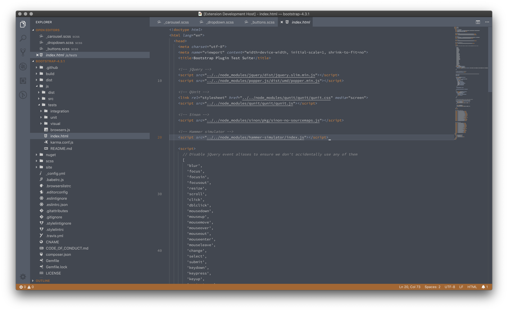

# README

Grueling Hare is a set of light and dark themes with emphasis on steel with burnt orange accents.  It is inspired by the astronaut suits in the [Lost in Space](https://www.imdb.com/title/tt5232792/) reboot TV series.

Code is styled intentionally (mostly) bichromatic to make it easier to focus when writing/reading.

## Light

### IDE

### CSS

### C#

### HTML

### JavaScript

## Dark

### IDE

### CSS

### C#

### HTML

### JavaScript
